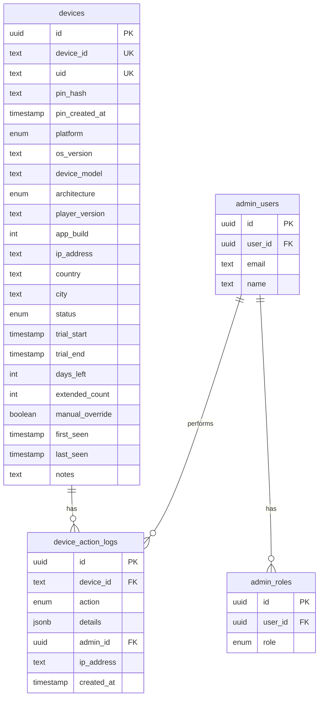

# Nova Player Core - Architecture

> **Version:** 1.0.0  
> **Last Updated:** 2026-01-21

Vue d'ensemble technique du projet Nova Player Core.

---

## Stack Technique

| Composant | Technologie |
|-----------|-------------|
| **Backend API** | Supabase Edge Functions (Deno/TypeScript) |
| **Base de données** | PostgreSQL (via Supabase) |
| **Frontend Admin** | React 18 + Vite + TypeScript |
| **UI Framework** | Tailwind CSS + shadcn/ui |
| **State Management** | TanStack Query (React Query) |
| **Authentification** | Supabase Auth |
| **Routing** | React Router v6 |

---

## Architecture globale

```
┌─────────────────────────────────────────────────────────────────┐
│                         CLIENTS                                  │
├─────────────────────────────────────────────────────────────────┤
│                                                                  │
│  ┌──────────────┐  ┌──────────────┐  ┌──────────────┐           │
│  │   Flutter    │  │   Flutter    │  │   Flutter    │           │
│  │   Android    │  │     iOS      │  │   Windows    │           │
│  └──────┬───────┘  └──────┬───────┘  └──────┬───────┘           │
│         │                 │                 │                    │
│         └────────────────┬┴─────────────────┘                    │
│                          │                                       │
│                          ▼                                       │
│  ┌───────────────────────────────────────────────────────────┐  │
│  │                    SUPABASE CLOUD                          │  │
│  │  ┌─────────────────────────────────────────────────────┐  │  │
│  │  │              EDGE FUNCTIONS (API)                    │  │  │
│  │  │  ┌─────────────────┐  ┌─────────────────────────┐   │  │  │
│  │  │  │ device-register │  │ admin-regenerate-pin    │   │  │  │
│  │  │  └─────────────────┘  └─────────────────────────┘   │  │  │
│  │  │  ┌─────────────────┐                                │  │  │
│  │  │  │  device-status  │                                │  │  │
│  │  │  └─────────────────┘                                │  │  │
│  │  └─────────────────────────────────────────────────────┘  │  │
│  │                          │                                 │  │
│  │                          ▼                                 │  │
│  │  ┌─────────────────────────────────────────────────────┐  │  │
│  │  │               POSTGRESQL DATABASE                    │  │  │
│  │  │  ┌─────────┐ ┌─────────────────┐ ┌─────────────┐   │  │  │
│  │  │  │ devices │ │device_action_logs│ │ admin_roles │   │  │  │
│  │  │  └─────────┘ └─────────────────┘ └─────────────┘   │  │  │
│  │  └─────────────────────────────────────────────────────┘  │  │
│  │                          │                                 │  │
│  │                          ▼                                 │  │
│  │  ┌─────────────────────────────────────────────────────┐  │  │
│  │  │                  SUPABASE AUTH                       │  │  │
│  │  │              (Admin authentication)                  │  │  │
│  │  └─────────────────────────────────────────────────────┘  │  │
│  └───────────────────────────────────────────────────────────┘  │
│                          ▲                                       │
│                          │                                       │
│  ┌──────────────────────┴────────────────────────────────────┐  │
│  │                    ADMIN PANEL                             │  │
│  │                   (React + Vite)                           │  │
│  └───────────────────────────────────────────────────────────┘  │
│                                                                  │
└─────────────────────────────────────────────────────────────────┘
```

---

## Structure des fichiers

```
nova-player-core/
│
├── supabase/
│   ├── functions/                    # Edge Functions (API Backend)
│   │   ├── device-register/
│   │   │   └── index.ts             # Enregistrement device + UID/PIN
│   │   ├── device-status/
│   │   │   └── index.ts             # Vérification status
│   │   └── admin-regenerate-pin/
│   │       └── index.ts             # Régénération PIN (admin)
│   ├── migrations/                   # Migrations SQL
│   │   ├── 001_initial_schema.sql
│   │   └── 002_uid_pin_system.sql
│   └── config.toml                   # Configuration Supabase
│
├── src/                              # Frontend Admin (React)
│   ├── components/
│   │   ├── admin/                    # Composants admin spécifiques
│   │   │   ├── AdminLayout.tsx
│   │   │   ├── Sidebar.tsx
│   │   │   ├── StatCard.tsx
│   │   │   ├── StatusBadge.tsx
│   │   │   └── PlatformIcon.tsx
│   │   └── ui/                       # Composants shadcn/ui
│   │       └── (button, card, dialog, etc.)
│   │
│   ├── hooks/
│   │   ├── useAuth.ts               # Hook authentification
│   │   └── useDevices.ts            # Hooks CRUD devices
│   │
│   ├── pages/
│   │   ├── Login.tsx                # Page connexion admin
│   │   ├── NotFound.tsx
│   │   └── admin/
│   │       ├── Dashboard.tsx        # Tableau de bord stats
│   │       ├── Devices.tsx          # Liste des devices
│   │       ├── DeviceDetail.tsx     # Détail + actions device
│   │       ├── Settings.tsx
│   │       └── Admins.tsx
│   │
│   ├── types/
│   │   └── device.ts                # Types TypeScript
│   │
│   ├── integrations/
│   │   └── supabase/
│   │       ├── client.ts            # Client Supabase (auto-généré)
│   │       └── types.ts             # Types DB (auto-généré)
│   │
│   ├── App.tsx                      # Composant principal + routes
│   └── main.tsx                     # Point d'entrée
│
├── database/
│   └── schema.sql                   # Schéma DB consolidé
│
├── docs/
│   ├── API_CONTRACT.md              # Contrat API Flutter
│   ├── DEVICE_FLOW.md               # Flux device
│   ├── UID_PIN_RULES.md             # Règles UID/PIN
│   └── ARCHITECTURE.md              # Ce document
│
├── .env.example                     # Template variables env
├── .gitignore
└── README.md
```

---

## Base de données

### Schéma ER



### Tables principales

| Table | Description |
|-------|-------------|
| `devices` | Tous les devices enregistrés |
| `device_action_logs` | Historique des actions |
| `admin_roles` | Rôles des administrateurs |
| `admin_users` | Informations admins |

---

## Sécurité

### Row Level Security (RLS)

| Table | Policy | Règle |
|-------|--------|-------|
| `devices` | Admins can view | `has_admin_role(auth.uid())` |
| `devices` | Allow registration | Public INSERT |
| `devices` | Allow status check | Public SELECT |
| `device_action_logs` | Admins can view | `has_admin_role(auth.uid())` |
| `admin_roles` | Admins can view | `has_admin_role(auth.uid())` |

### Fonctions de sécurité

```sql
-- Vérifie si l'utilisateur est admin
CREATE FUNCTION has_admin_role(_user_id uuid) RETURNS boolean;

-- Vérifie si l'utilisateur est super admin
CREATE FUNCTION is_super_admin(_user_id uuid) RETURNS boolean;
```

### Hashage PIN

- Algorithme : **bcrypt**
- Le PIN n'est **jamais** stocké en clair
- Validation via `bcrypt.compare()`

---

## Edge Functions

### device-register

| Aspect | Détail |
|--------|--------|
| URL | `POST /device-register` |
| Auth | Public |
| Rôle | Enregistrer nouveau device, générer UID/PIN |

### device-status

| Aspect | Détail |
|--------|--------|
| URL | `POST /device-status` |
| Auth | Public |
| Rôle | Vérifier status, mettre à jour last_seen |

### admin-regenerate-pin

| Aspect | Détail |
|--------|--------|
| URL | `POST /admin-regenerate-pin` |
| Auth | JWT Admin requis |
| Rôle | Régénérer PIN d'un device |

---

## Frontend Admin

### Stack

- **React 18** - Framework UI
- **Vite** - Build tool
- **TypeScript** - Typage statique
- **Tailwind CSS** - Styling utilitaire
- **shadcn/ui** - Composants UI
- **TanStack Query** - State management async
- **React Router v6** - Routing
- **Recharts** - Graphiques

### Patterns

| Pattern | Usage |
|---------|-------|
| Custom Hooks | `useDevices`, `useAuth`, etc. |
| React Query | Fetching, caching, mutations |
| Protected Routes | `ProtectedRoute` component |
| Layout Pattern | `AdminLayout` wrapper |

### Routes

| Route | Composant | Description |
|-------|-----------|-------------|
| `/login` | Login | Connexion admin |
| `/admin` | Dashboard | Tableau de bord |
| `/admin/devices` | Devices | Liste devices |
| `/admin/devices/:id` | DeviceDetail | Détail device |
| `/admin/settings` | Settings | Paramètres |
| `/admin/admins` | Admins | Gestion admins |

---

## Déploiement

### Environnement

```env
VITE_SUPABASE_URL=https://xxx.supabase.co
VITE_SUPABASE_PUBLISHABLE_KEY=eyJ...
VITE_SUPABASE_PROJECT_ID=xxx
```

### Pipeline

1. **Code Push** → GitHub
2. **Lovable** détecte les changements
3. **Edge Functions** déployées automatiquement
4. **Frontend** build et déployé
5. **Migrations** appliquées si présentes

---

## Performance

### Optimisations

| Optimisation | Détail |
|--------------|--------|
| Query Caching | TanStack Query avec staleTime |
| Code Splitting | React.lazy pour routes |
| Index DB | `idx_devices_uid` pour recherche UID |
| RLS | Filtrage côté DB |

### Limites

| Ressource | Limite |
|-----------|--------|
| Rows par query | 1000 (Supabase default) |
| Edge Function timeout | 60s |
| Request body | 6MB |

---

## Monitoring

### Logs

- **Edge Functions** : Console logs Supabase
- **Actions** : Table `device_action_logs`
- **Errors** : Supabase Dashboard

### Métriques clés

- Nombre de devices par status
- Devices actifs (last_seen < 24h)
- Taux de conversion trial → active
- Devices par plateforme/pays
