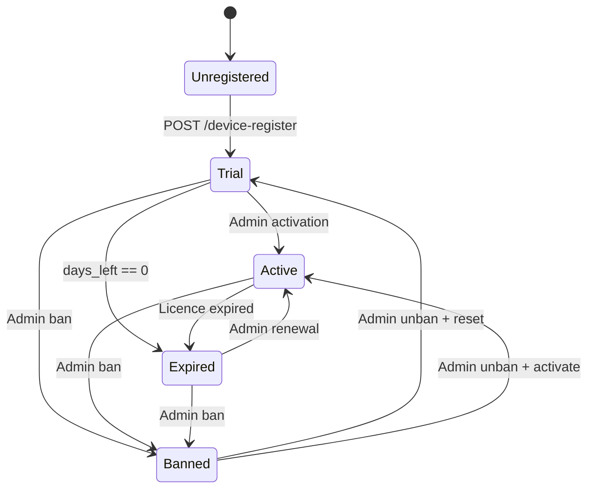
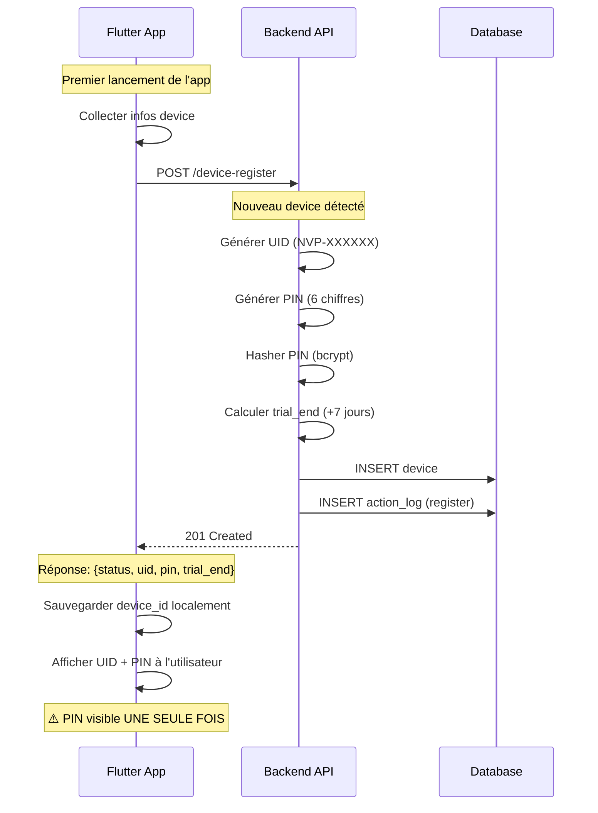
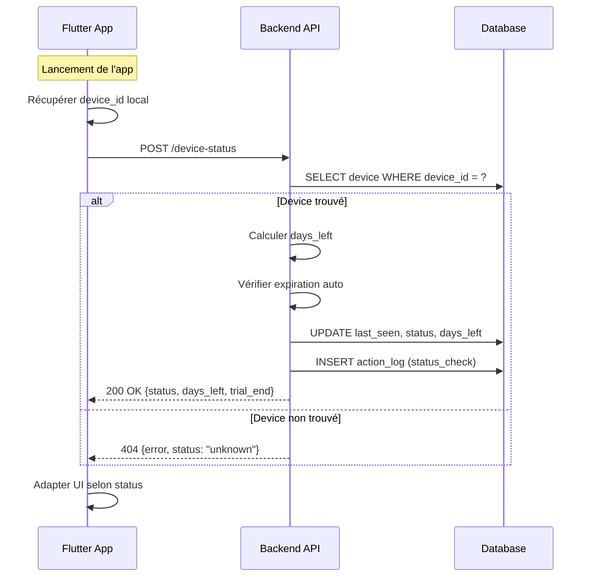
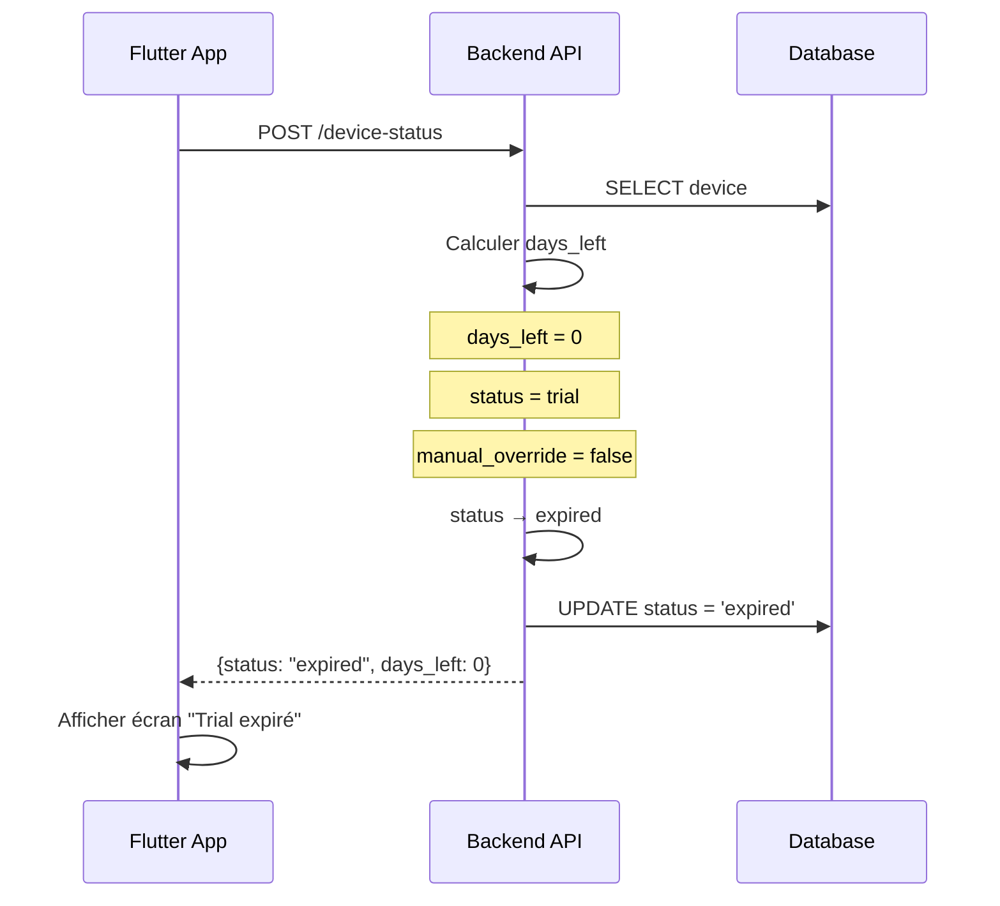
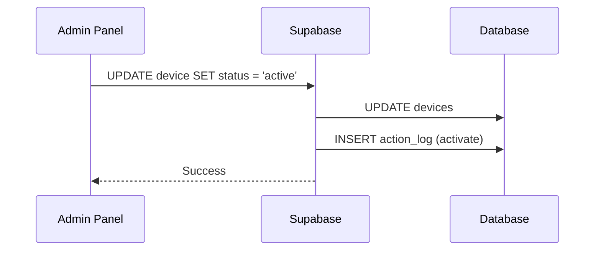
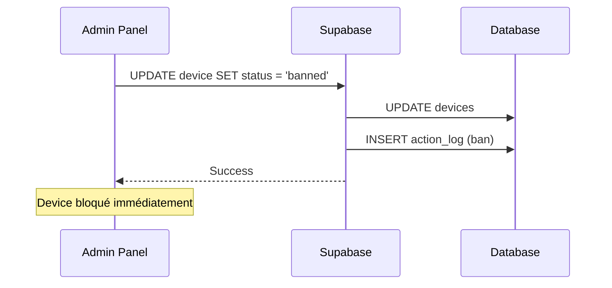
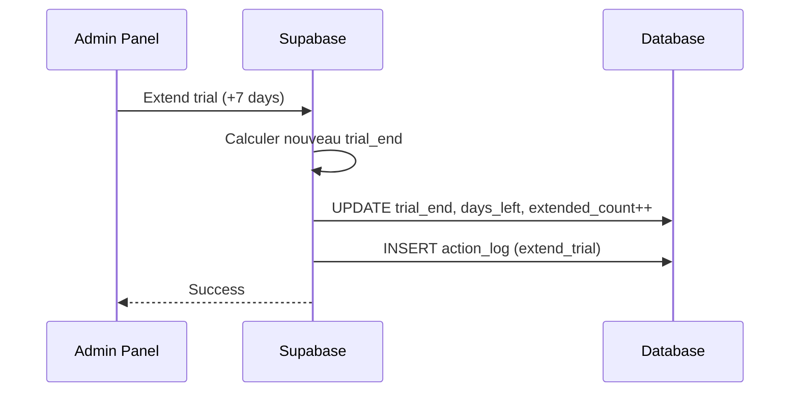
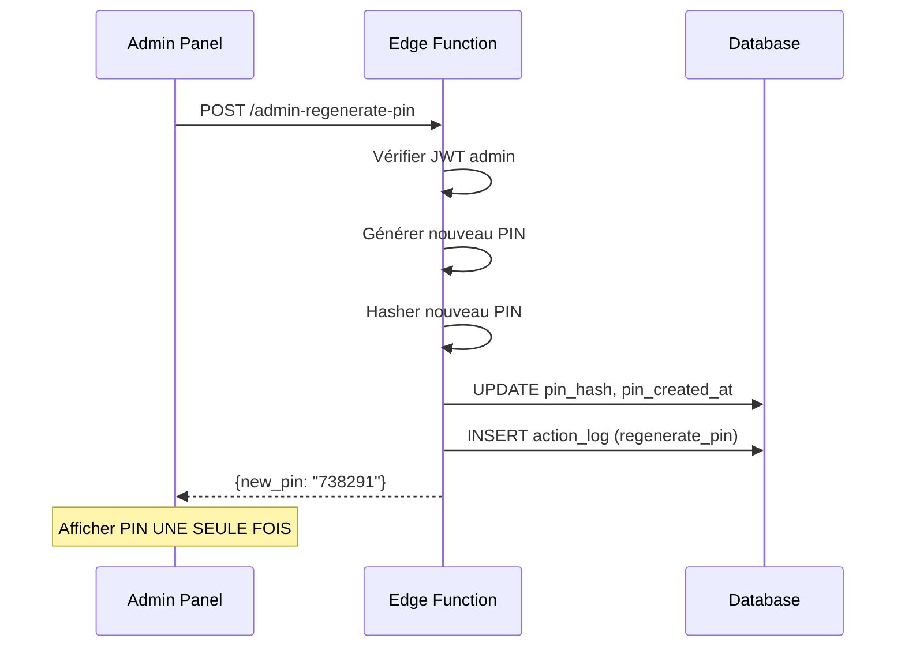

# Nova Player - Device Flow

> **Version:** 1.0.0  
> **Last Updated:** 2026-01-21

Ce document décrit le cycle de vie complet d'un device Nova Player.

---

## Vue d'ensemble



---

## États du Device

| État | Description | Accès App |
|------|-------------|-----------|
| `trial` | Période d'essai (7 jours par défaut) | ✅ Complet |
| `active` | Licence active | ✅ Complet |
| `expired` | Trial ou licence expirée | ⚠️ Limité |
| `banned` | Banni par admin | ❌ Bloqué |

---

## Flux 1: Premier lancement (Registration)



### Request

```json
{
  "device_id": "a1b2c3d4-e5f6-7890-abcd-ef1234567890",
  "platform": "android",
  "os_version": "14",
  "device_model": "Samsung Galaxy S24",
  "architecture": "arm64",
  "player_version": "1.0.0",
  "app_build": 1
}
```

### Response (201 Created)

```json
{
  "status": "trial",
  "uid": "NVP-7F3A9C",
  "pin": "482917",
  "days_left": 7,
  "trial_end": "2026-01-28",
  "manual_override": false
}
```

---

## Flux 2: Lancement suivant (Status Check)



### Request

```json
{
  "device_id": "a1b2c3d4-e5f6-7890-abcd-ef1234567890",
  "ip_address": "192.168.1.100"
}
```

### Response (200 OK)

```json
{
  "status": "trial",
  "days_left": 5,
  "trial_end": "2026-01-28",
  "manual_override": false
}
```

---

## Flux 3: Expiration automatique



---

## Flux 4: Actions Admin

### 4.1 Activer un device



### 4.2 Bannir un device



### 4.3 Étendre le trial



### 4.4 Régénérer PIN



---

## Comportement de l'app selon le status

| Status | Comportement app |
|--------|-----------------|
| `trial` | Fonctionnalités complètes + badge "Trial" |
| `active` | Fonctionnalités complètes |
| `expired` | Écran "Licence expirée" + options renouvellement |
| `banned` | Écran "Accès bloqué" + contact support |

---

## Gestion du manual_override

Le flag `manual_override` permet de **figer** le status d'un device.

| manual_override | Effet |
|-----------------|-------|
| `false` | Expiration automatique si days_left = 0 |
| `true` | Status **fixe**, aucune modification auto |

### Cas d'usage

- Admin veut garder un device en `active` indéfiniment
- Admin veut maintenir un `trial` au-delà de l'expiration
- Test ou support technique

---

## Timeline typique

```
Jour 0   │ Installation app → POST /device-register
         │ Réception UID + PIN
         │ Status: trial, days_left: 7
         │
Jour 1-6 │ Lancement app → POST /device-status
         │ Status: trial, days_left: 6→1
         │
Jour 7   │ Lancement app → POST /device-status
         │ days_left: 0 → Status: expired
         │
         │ [Option A] Admin: Extend trial
         │ Status: trial, days_left: 7
         │
         │ [Option B] Admin: Activate
         │ Status: active
         │
         │ [Option C] Aucune action
         │ Status reste: expired
```

---

## Données collectées

### À l'enregistrement

| Donnée | Source | Usage |
|--------|--------|-------|
| device_id | Flutter | Identification unique |
| platform | Flutter | Stats, filtres |
| os_version | Flutter | Compatibilité |
| device_model | Flutter | Support |
| architecture | Flutter | Compatibilité |
| player_version | Flutter | Updates |
| app_build | Flutter | Versioning |
| ip_address | Headers | GeoIP (futur) |

### À chaque status check

| Donnée | Source | Usage |
|--------|--------|-------|
| ip_address | Headers | GeoIP, sécurité |
| last_seen | Serveur | Activité |

---

## Logs d'actions

Chaque action importante est loggée dans `device_action_logs` :

```json
{
  "id": "uuid",
  "device_id": "a1b2c3d4...",
  "action": "register | status_check | activate | ban | ...",
  "details": { ... },
  "admin_id": "uuid | null",
  "ip_address": "192.168.1.100",
  "created_at": "2026-01-21T10:30:00Z"
}
```
