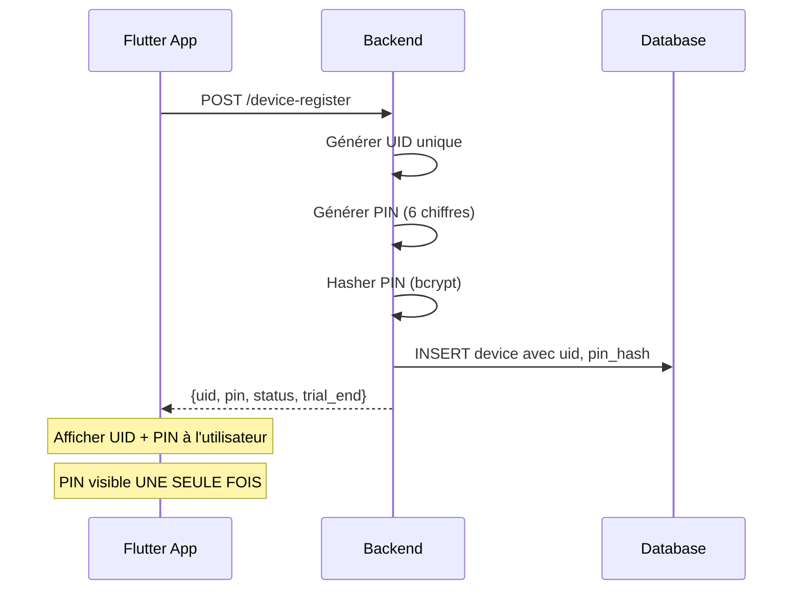
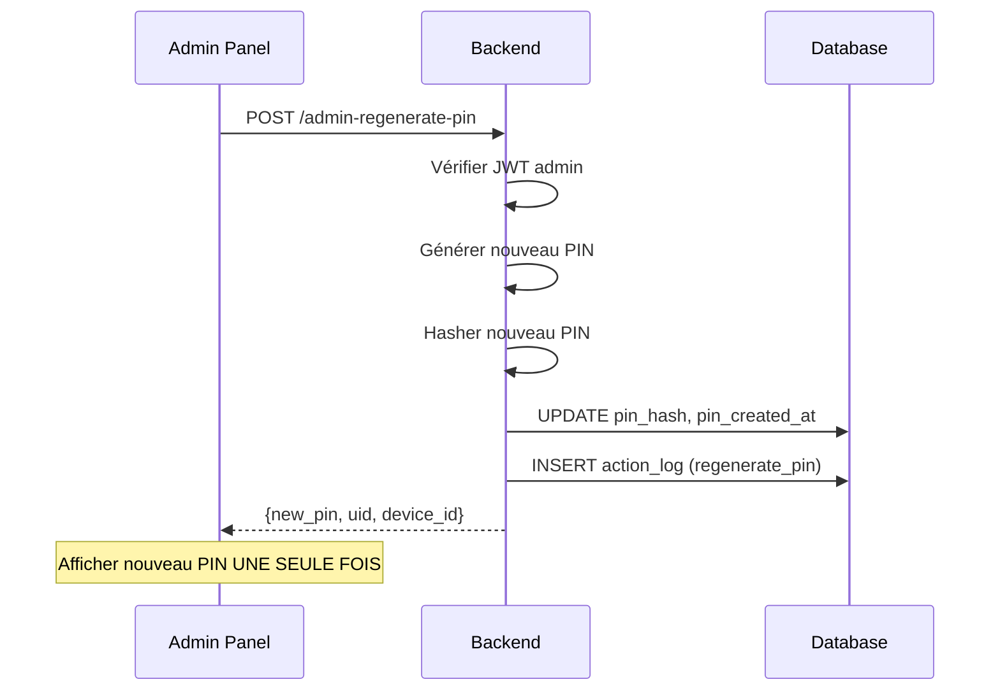
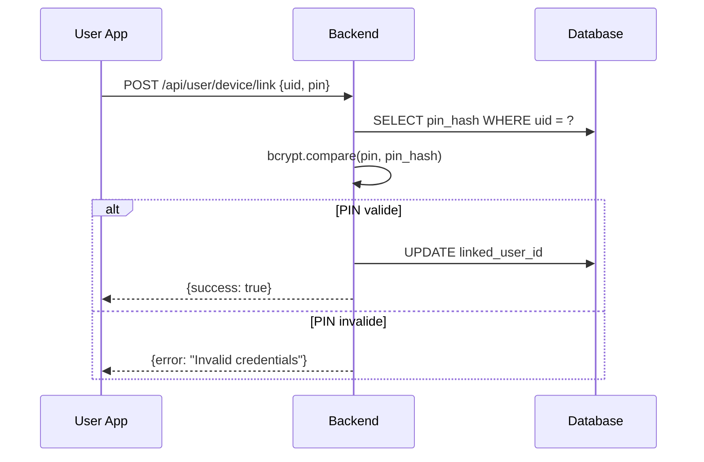

# Nova Player - Règles UID & PIN

> **Version:** 1.0.0  
> **Last Updated:** 2026-01-21

Ce document définit les règles de sécurité et de gestion du système d'identification UID + PIN.

---

## Vue d'ensemble

Le système UID + PIN permet :
- **Identification publique** d'un device via son UID
- **Liaison sécurisée** device ↔ compte utilisateur via UID + PIN
- **Gestion admin** avec régénération de PIN si nécessaire

---

## UID (Identifiant Unique)

### Format

```
NVP-XXXXXX
```

| Élément | Description |
|---------|-------------|
| Préfixe | `NVP-` (Nova Player) |
| Suffixe | 6 caractères alphanumériques |

### Caractères autorisés

```
ABCDEFGHJKLMNPQRSTUVWXYZ23456789
```

> **Exclus pour lisibilité :** I, O, 0, 1 (évite confusion I/1 et O/0)

### Règles

| Règle | Description |
|-------|-------------|
| Unicité | Chaque UID est unique dans le système |
| Immuabilité | L'UID ne change **jamais** après création |
| Visibilité | L'UID est **public** (peut être partagé) |
| Génération | Généré côté **backend uniquement** |

### Exemple de génération

```typescript
function generateUID(): string {
  const chars = 'ABCDEFGHJKLMNPQRSTUVWXYZ23456789';
  let uid = 'NVP-';
  for (let i = 0; i < 6; i++) {
    uid += chars.charAt(Math.floor(Math.random() * chars.length));
  }
  return uid;
}
```

### Prévention des collisions

```typescript
async function generateUniqueUID(supabase): Promise<string> {
  let uid: string;
  let exists = true;
  let attempts = 0;
  const maxAttempts = 10;

  while (exists && attempts < maxAttempts) {
    uid = generateUID();
    const { data } = await supabase
      .from('devices')
      .select('uid')
      .eq('uid', uid)
      .maybeSingle();
    exists = !!data;
    attempts++;
  }

  if (exists) {
    throw new Error('Failed to generate unique UID');
  }

  return uid;
}
```

---

## PIN (Code Personnel)

### Format

```
6 chiffres (000000 - 999999)
```

### Règles

| Règle | Description |
|-------|-------------|
| Longueur | Exactement 6 chiffres |
| Génération | Généré côté **backend uniquement** |
| Stockage | **Hashé** en base (bcrypt) |
| Affichage | Retourné **UNE SEULE FOIS** à la création |
| Fixité | Le PIN est **fixe** (pas d'expiration) |
| Régénération | Uniquement par un **admin** |

### Exemple de génération

```typescript
function generatePIN(): string {
  return Math.floor(100000 + Math.random() * 900000).toString();
}
```

### Hashage (bcrypt)

```typescript
import * as bcrypt from "https://deno.land/x/bcrypt@v0.4.1/mod.ts";

// Hashage
const pinHash = await bcrypt.hash(pin);

// Vérification
const isValid = await bcrypt.compare(inputPin, storedHash);
```

---

## Schéma de données

```sql
-- Champs ajoutés à la table devices
uid TEXT UNIQUE,              -- Format: NVP-XXXXXX
pin_hash TEXT,                -- Hash bcrypt du PIN
pin_created_at TIMESTAMPTZ    -- Date de création/régénération
```

---

## Flux de création



---

## Flux de régénération (Admin)



---

## Flux de liaison (Futur)



---

## Sécurité

### ✅ Ce qui est autorisé

- Afficher l'UID publiquement
- Partager l'UID avec le support
- Copier l'UID dans l'app

### ❌ Ce qui est interdit

| Interdiction | Raison |
|--------------|--------|
| Stocker PIN en clair | Sécurité |
| Retourner PIN après création | Sécurité |
| Générer UID/PIN côté client | Intégrité |
| Modifier PIN automatiquement | Stabilité |
| Exposer pin_hash au frontend | Sécurité |

### Logging

Toutes les régénérations de PIN sont loggées :

```json
{
  "action": "regenerate_pin",
  "device_id": "xxx",
  "admin_id": "uuid",
  "details": {
    "reason": "admin_request"
  },
  "created_at": "2026-01-21T..."
}
```

---

## FAQ

### Que faire si l'utilisateur perd son PIN ?

L'admin peut régénérer un nouveau PIN via le panel admin. L'ancien PIN devient invalide immédiatement.

### Le PIN expire-t-il ?

Non, le PIN est **fixe** et n'a pas de date d'expiration.

### Peut-on avoir plusieurs devices avec le même UID ?

Non, chaque UID est **unique** et correspond à un seul device.

### Comment valider un PIN ?

```typescript
const isValid = await bcrypt.compare(userInputPin, device.pin_hash);
```
